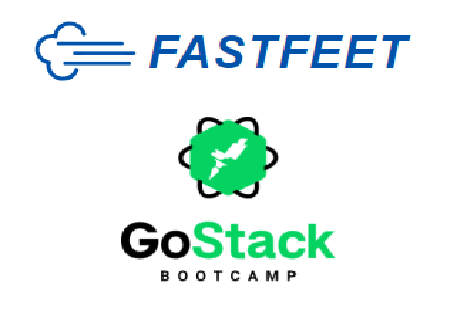

<h1 align="center">
  
</h1>

<h3 align="center">
  Desafio  FastFeet, o início
</h3>


<p>Esse desafio faz parte do Desafio Final, que é uma aplicação completa (Back-end, Front-end e Mobile) que é avaliada para emissão do Certificado do Bootcamp GoStack, por isso é fundamental que ele seja feito com muito empenho!</p>

<p>Começando a primeira etapa dia 29/01 e treminada 05/00 de quatro partes. </p>

<p>Começando a segunda etapa dia 06/02 e treminada 16/02 de quatro partes. </p>

<p>Começando a terceira etapa dia / e treminada / de quatro partes. </p>

<p>Começando a quarta etapa dia / e treminada / de quatro partes. </p>


### :memo: Sobre a aplicação

Esta é uma API REST construída para uma transportadora fictícia, A FastFeet. Toda a API é escrita em NodeJs usando MVC, banco de dados PostgreSQL.

### :bookmark_tabs: **Funcionalidades de administrador**

- **Autenticação:** se autenticar no sistema para exercer restritas a usuarios autenticados.
- **Gestão de destinatários:** cadastrar, atualizar e listar destinatários cadastrados.
- **Gestão de entregadores:** cadastrar, atualizar e listar entregadores cadastrados.
- **Gestão de encomendas:** cadastrar, atualizar, listar e cancelar encomendas cadastradas.

Toda vez que uma encomenda é cadastrado para um entregador, o mesmo recebe um alerta no seu email com as informações, assim como acontece no cancelamento de uma entrega.

### :bookmark_tabs: **Funcionalidades do entregador**

- **Visualizar encomendas:** informando o seu ID de cadastro, o entregador consegue visualizar todas suas encomendas.
- **Alterar status de encomendas:** o entregador pode definir uma data de retirada e de entrega para a encomenda, durante o periodo de 8:00 às 18:00 horas.
- **Cadastrar problemas nas entregas:** o entregador pode cadastrar problemas que ocorreram durante a entrega. Assim os problemas ficam registrados e o administrador pode decidir se a entrega deve ser cancelada ou não.

### :bookmark_tabs: **Rotas**
As rotas estão disponiveis pra consulta no arquivo <a href="https://https://github.com/fabianoobispo/FastFeet/blob/master/Insomnia_2020-02-13.json" target="_blank" alt="Rotas">Insomnia.json</a>

### Instalando Dependências
```sh
git clone ...
cd FastFeet
yarn
```

### Subindo os bancos
```sh
mkdir db
docker run --name postgresfast -e POSTGRES_PASSWORD=docker -p 5432:5432 -d postgres
docker run --name redisfast -p 6979:6379 -d -t redis:alpine
```


### Rodando migração e criando usuário Admin
```sh
yarn sequelize db:migrate
yarn sequelize db:seed:all
```

### Subindo a aplicação
```sh
yarn dev
```
### Subindo a fila de jobs para envio de emails
```sh
yarn queue
```
### Com autenticação JWT

### Realizando as devidas validaçôes

### Envio de email para nova entrega e concelamneto de entrega.

### **Rotas**

Abaixo estão descritas as rotas do sistema.

  #### - Sessions (/sessions)

   | Resource | Method | Params (JSON) | Headers |
| :---:      | :---:  |    :---:      |    :---: |
| /sessions    | POST  | {email, password} | {/} |

#### - Repicients (/recipient)

   | Resource | Method | Params (JSON) | Headers |
| :---:      | :---:  |    :---:      |    :---: |
| /recipient    | GET   | {/} | JWT |
| /recipient/:id    | GET    | {/} | JWT |
| /recipient    | POST   | { name, street, number, complement, state, city, cep} | JWT |
| /recipient/:id    | PUT    | { name, street, number, complement, state, city, cep}  | JWT |
| /recipient/:id    | DELETE   | {/} | JWT |


  #### - Deliverymans (/deliverymans)

   | Resource | Method | Params (JSON) | Headers |
| :---:      | :---:  |    :---:      |    :---: |
| /deliverymans    | GET  | {/} | JWT |
| /deliverymans/:id    | GET  | {/} | JWT|
| /deliverymans    | POST  | {email,name, avatar_id } | JWT |
| /deliverymans    | PUT  | {email, name, avatar_id } | JWT |
| /deliverymans/:id    | DELETE  | {/} | JWT |

  #### - Delivery (/deliverymans)

   | Resource | Method | Params (JSON) | Headers |
| :---:      | :---:  |    :---:      |    :---: |
| /deliverymans/:id    | GET  | {/} | JWT|
| /deliverymans    | POST  | {product, recipient_id, deliveryman_id } | JWT |
| /deliverymans    | PUT  | {product, recipient_id, deliveryman_id, start_dat, end_date, canceled_at } | JWT |
| /deliverymans/:id    | DELETE  | {/} | JWT |


  #### - Withdrawal of orders (/deliverymans)

   | Resource | Method | Params (JSON) | Headers |
| :---:      | :---:  |    :---:      |    :---: |
| /deliverymans/:deliverymanId/deliveries  | GET  | {/} | {/} |
| /deliverymans/:deliverymanId/deliveries/:deliveryId    | PUT  | { start_date } | {/} |


 #### - Problems 

   | Resource | Method | Params (JSON) | Headers |
| :---:      | :---:  |    :---:      |    :---: |
| /deliveries/:deliveryId/problems   | POST  | {description} | JWT|
| /problems   | GET  | {/} | JWT |
| /problems/:deliveryId    | GET  | {ID} | JWT |
| /problems/:problemId    | DELETE  | {ID} | JWT |


  

# para o desafio 03 falta fazer:


